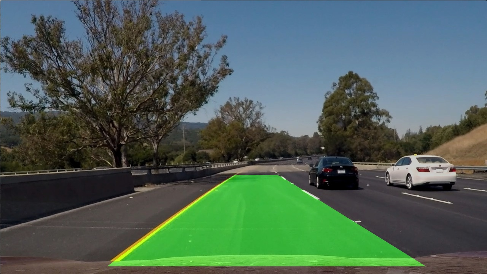

# Advanced_Lane_Detector

The goal of this project was to detect the current lane the vehicle is driving on  by using its forward facing camera. This is a somewhat naive way as it is mainly using computer vision techniques (no relation to naive Bayesian!). Features we are going to detect and track are lane boundaries and surrounding vehicles

Based on:
 * https://navoshta.com/detecting-road-features/
 * https://github.com/ndrplz/self-driving-car/tree/master/project_4_advanced_lane_finding
 
 
